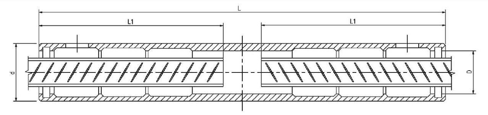

钢筋连接器速查清单
===

本备忘单总结了装配式混凝土结构中常用的钢筋连接器资料。

灌浆套筒
---

<!-- ### 介绍

[LaTeX](https://www.latex-project.org/) 基于 TEX 的排版系统，适用于生成高印刷质量的科技和数学、物理文档。

- [LaTeX 官网](https://www.latex-project.org/) _(latex-project.org)_

而 [KaTeX](https://katex.org/) 只处理 LaTeX 的数学符号的一个更小的子集，用于 web 上展示

- [KaTeX 官网](https://katex.org/) _(katex.org)_ -->

### JM全灌浆套筒
<!--rehype:wrap-class=col-span-2-->
| 套筒型号 | 连接钢筋 直径 d1 (mm) | 可连接其它规格 钢筋直径 d (mm) | 套筒外径  d (mm) | 套筒长度  L (mm) | 灌浆端口 孔径 D (mm) | 钢筋插入最 小深度 L1 (mm) |
| :--- | :--- | :--- | :--- | :--- | :--- | :--- |
| CT16H | Φ16 | Φ12, Φ14 | Φ38 | 256 | Φ28.5 ± 0.2 | 113～128 |
| CT20H | Φ20 | Φ18, Φ16 | Φ42 | 320 | Φ32.5 ± 0.2 | 145～160 |
| CT22H | Φ22 | Φ20, Φ18 | Φ45 | 350 | Φ35 ± 0.2 | 160～175 |
| CT25H | Φ25 | Φ22, Φ20 | Φ50 | 400 | Φ38.5 ± 0.2 | 185～200 |
| CT32H | Φ32 | Φ28, Φ25 | Φ63 | 510 | Φ48 ± 0.2 | 240～255 |
<!--rehype:className=show-header wrap-text left-align-->

### JM全灌浆套筒说明
<!--rehype:wrap-class=col-span-1-->
<!--  -->
**注：**
- 套筒材料：优质碳素结构钢或合金结构钢，机械性能：抗拉强度 ≥ 600 MPa，屈服强度 ≥ 355 MPa，断后伸长率 ≥ 16%。
- 套筒两端装有橡胶密封环，灌浆孔、出浆孔在套筒两端部。

数据来自《装配式混凝土连接节点构造》（15G310-2）。 